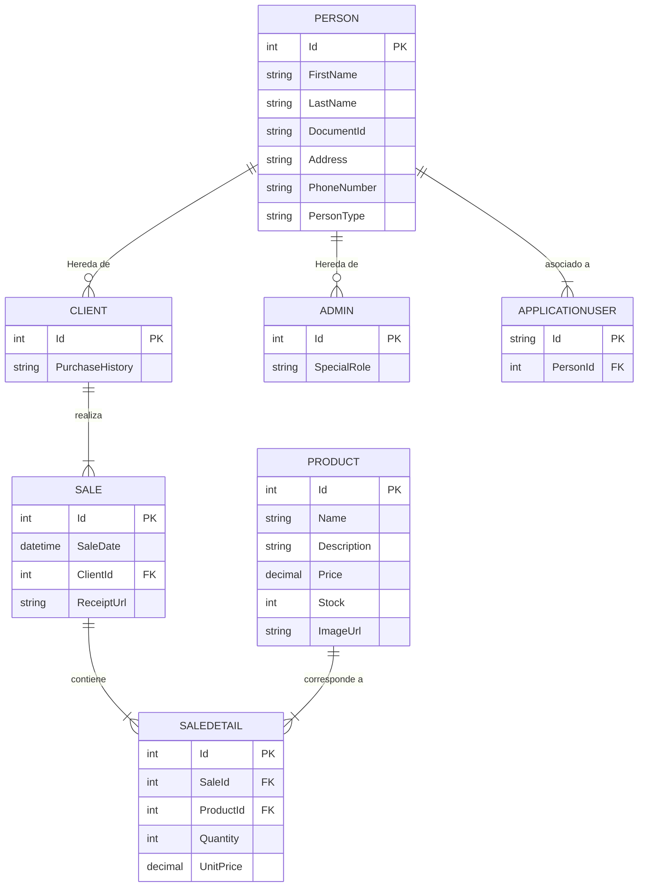
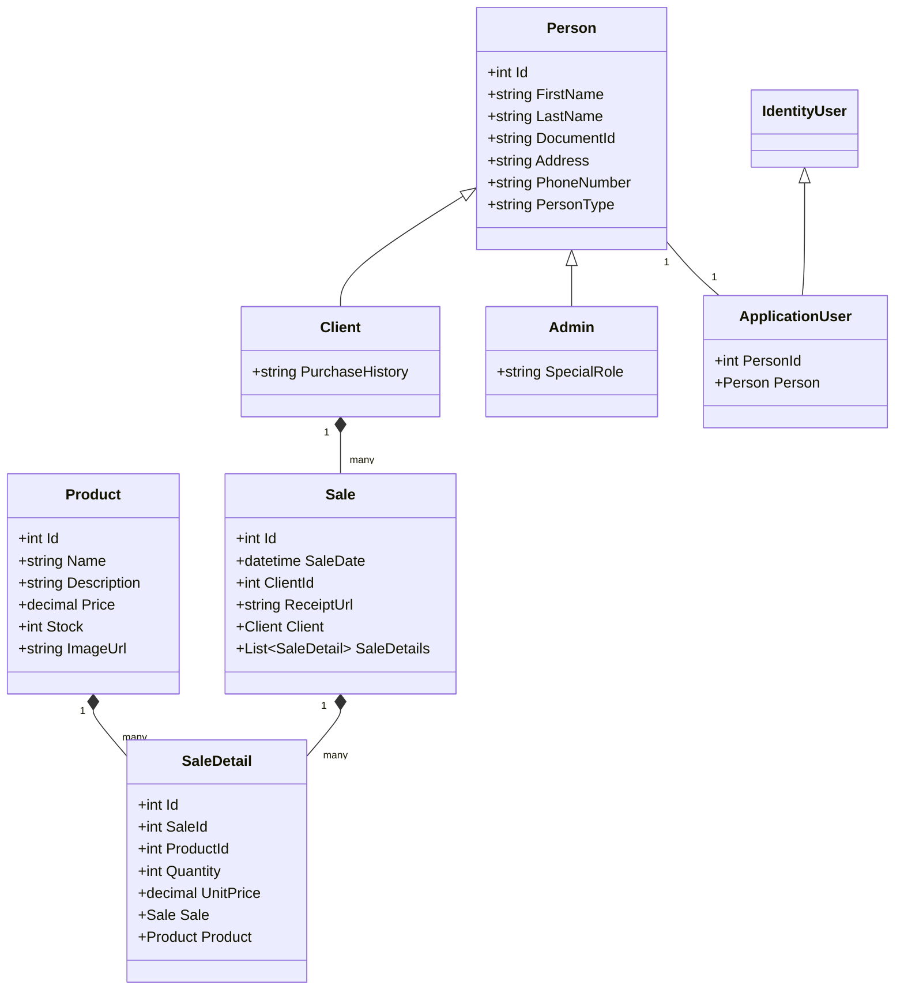

# Firmness.Web - Sistema de Gestión de Ventas

## 1. Información General

**Firmness.Web** es una aplicación web robusta desarrollada en ASP.NET Core, diseñada para la gestión integral de ventas, productos y clientes. El sistema permite a los administradores llevar un control detallado del inventario, gestionar la información de los clientes y registrar las ventas, generando automáticamente los comprobantes correspondientes.

### 1.1. Características Principales

- **Gestión de Productos**: Permite crear, editar, eliminar y listar productos, incluyendo información como nombre, descripción, precio, stock e imagen.
- **Gestión de Clientes**: Administración completa de la información de los clientes, incluyendo datos personales e historial de compras.
- **Registro de Ventas**: Interfaz dinámica para registrar nuevas ventas, seleccionando clientes y productos, con cálculo automático de totales.
- **Generación de Recibos en PDF**: Al registrar una venta, el sistema genera automáticamente un recibo en formato PDF que se almacena y puede ser descargado.
- **Importación de Datos**: Funcionalidad para importar datos de productos, clientes y ventas desde archivos `.xlsx`, normalizando y validando la información automáticamente.
- **Exportación de Datos**: Permite exportar listados de productos y clientes a formato Excel.
- **Autenticación y Autorización**: Sistema de seguridad basado en roles, con una distinción clara entre administradores y otros tipos de usuarios.

### 1.2. Stack Tecnológico

- **Backend**: ASP.NET Core 8
- **Base de Datos**: PostgreSQL
- **Frontend**: Razor Pages, HTML, CSS, JavaScript, Bootstrap
- **Librerías Adicionales**:
  - **Entity Framework Core**: Para el ORM y la interacción con la base de datos.
  - **EPPlus**: Para la importación y exportación de datos en formato Excel.
  - **QuestPDF**: Para la generación de documentos PDF.
  - **ASP.NET Core Identity**: Para la gestión de usuarios y roles.

---

## 2. Diagramas Técnicos

### 2.1. Modelo Entidad-Relación (ERD)

Este diagrama muestra la estructura de la base de datos, incluyendo las tablas principales y las relaciones entre ellas.



### 2.2. Diagrama de Clases

Este diagrama muestra las clases principales del dominio y sus relaciones.



---

## 3. Instalación y Ejecución

### 3.1. Ejecución Local

**Requisitos Previos**:
- [.NET 8 SDK](https://dotnet.microsoft.com/download/dotnet/8.0)
- [PostgreSQL](https://www.postgresql.org/download/)

**Pasos**:

1.  **Clonar el Repositorio**:
    ```bash
    git clone <URL_DEL_REPOSITORIO>
    cd Firmness
    ```

2.  **Configurar la Base de Datos**:
    - Asegúrate de que tu instancia de PostgreSQL esté en ejecución.
    - Abre el archivo `Firmness.Web/appsettings.json` y modifica la cadena de conexión (`DefaultConnection`) con tus credenciales de PostgreSQL.

3.  **Aplicar Migraciones**:
    - Navega al directorio del proyecto web:
      ```bash
      cd Firmness.Web
      ```
    - Aplica las migraciones de Entity Framework para crear el esquema de la base de datos:
      ```bash
      dotnet ef database update
      ```

4.  **Ejecutar la Aplicación**:
    ```bash
    dotnet run
    ```
    La aplicación estará disponible en `http://localhost:5121`.

### 3.2. Ejecución con Docker

**Requisitos Previos**:
- [Docker](https://www.docker.com/products/docker-desktop/)

**Pasos**:

1.  **Crear un `Dockerfile`**:
    - En el directorio raíz del proyecto (`Firmness`), crea un archivo llamado `Dockerfile` con el siguiente contenido:
    ```Dockerfile
    FROM mcr.microsoft.com/dotnet/sdk:8.0 AS build
    WORKDIR /source

    COPY *.sln .
    COPY Firmness.Web/*.csproj ./Firmness.Web/
    RUN dotnet restore

    COPY . .
    WORKDIR /source/Firmness.Web
    RUN dotnet publish -c release -o /app --no-restore

    FROM mcr.microsoft.com/dotnet/aspnet:8.0
    WORKDIR /app
    COPY --from=build /app ./

    ENTRYPOINT ["dotnet", "Firmness.Web.dll"]
    ```

2.  **Crear un archivo `docker-compose.yml`**:
    - En el directorio raíz, crea un archivo `docker-compose.yml` para orquestar la aplicación y la base de datos:
    ```yml
    version: '3.8'
    services:
      db:
        image: postgres:latest
        environment:
          POSTGRES_USER: user
          POSTGRES_PASSWORD: password
          POSTGRES_DB: firmness_db
        ports:
          - "5432:5432"
        volumes:
          - postgres_data:/var/lib/postgresql/data

      web:
        build: .
        ports:
          - "8080:80"
        environment:
          ASPNETCORE_URLS: "http://+:80"
          ConnectionStrings__DefaultConnection: "Host=db;Database=firmness_db;Username=user;Password=password"
        depends_on:
          - db

    volumes:
      postgres_data:
    ```

3.  **Construir y Ejecutar**:
    - Abre una terminal en el directorio raíz y ejecuta:
    ```bash
    docker-compose up --build
    ```
    La aplicación estará disponible en `http://localhost:8080`.
